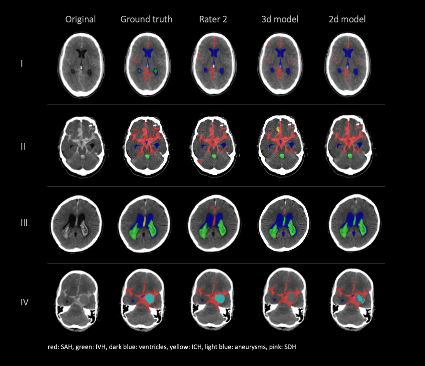
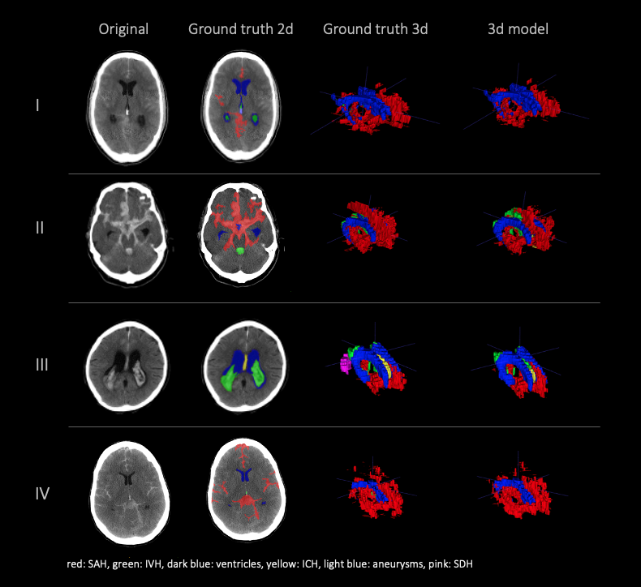
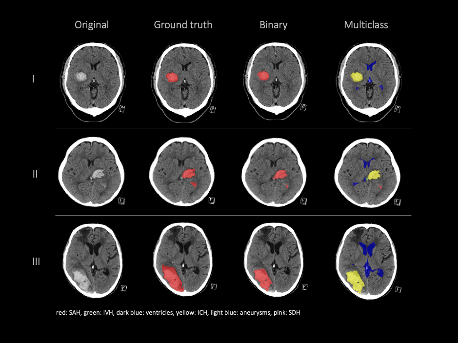

# Deep Learning-based Multiclass Segmentation in Aneurysmal Subarachnoid Hemorrhage

The 2d and 3d [nnUnet](https://github.com/MIC-DKFZ/nnUNet) were trained for semantic segmentation of 6 classes in non-contrast CT images of aneurysmal SAH patients:
* Subarachnoid hemorrhage (SAH)
* Intraventricular hemorrhage
* Ventricles
* Intracerebral hemorrhage
* Aneurysm
* Subdural hemorrhage

## Paper link
For details on the training, validation and performance evaluation, please check out our paper: \
[Deep Learning-based Multiclass Segmentation in Aneurysmal Subarachnoid Hemorrhage](https://www.medrxiv.org/content/10.1101/2024.06.24.24309431v1)

## Results
### 2d and 3d model configurations compared to 2 human raters 

### 3D visualization of hemorrhage distributions 

### External validation results 

## Documentation of the original nnUnet Paper: 
https://github.com/MIC-DKFZ/nnUNet

## Data
A total of 73 non contrast computed tomography (NCCT) data of patients diagnosed with acute aneurysmal SAH
at admission were used for model development.
The median volume was 512x512x28 and slice thickness varied between 5.5 and 6.5 mm. 

* 43 train 
* 10 validation 
* 20 test

## Folder structure
- Folder `demo_data/NCCT`: contains 3 example NCCT volumes from the [BHSD dataset](https://link.springer.com/chapter/10.1007/978-3-031-45673-2_15) to demonstrate model utility. (see full citation below.)
- Folder `demo_data/segmentations`: empty output folder for segmentation outputs of the model
- Folder `nnUNET_results`: Hyperparameter configuration files for [nnUnet](https://github.com/MIC-DKFZ/nnUNet). Weights should be downloaded and placed inside respective model folders.

## Inference 
Download model weights from [Zenodo](https://zenodo.org/records/12579491). Place the downloaded models inside the respective model folders. \
For example: ./nnUNET_results/Dataset001_SAH/nnUNetTrainer__nnUNetPlans__2d/fold_0

Inference command 3d model: 
- CUDA_VISIBLE_DEVICES=0 nnUNetv2_predict -i ./demo_data/NCCT -o ./demo_data/segmentations -d 001 -c 3d_fullres -f 0 -chk 3d_checkpoint_best.pth

Inference command 2d model: 
- CUDA_VISIBLE_DEVICES=0 nnUNetv2_predict -i ./demo_data/NCCT -o ./demo_data/segmentations -d 001 -c 2d -f 0 -chk 2d_checkpoint_best.pth

## Future use case
The multiclass semantic segmentation of aSAH related pathologies enables extraction of relevant outcome related data from NCCT images. \
This paves the way for outcome prediction research in aSAH using large imaging datasets.

## LICENSE
This work is licensed under a
[Creative Commons Attribution-NonCommercial 4.0 International License](https://creativecommons.org/licenses/by-nc/4.0/)

## References
Deep Learning-based Multiclass Segmentation in Aneurysmal Subarachnoid Hemorrhage
Julia Kiewitz, Orhun Utku Aydin, Adam Hilbert, Marie Gultom, Anouar Nouri, Ahmed A Khalil, Peter Vajkoczy, Satoru Tanioka, Fujimaro Ishida, Nora F. Dengler, Dietmar Frey
medRxiv 2024.06.24.24309431; doi: https://doi.org/10.1101/2024.06.24.24309431 

Wu, B. et al. (2024). BHSD: A 3D Multi-class Brain Hemorrhage Segmentation Dataset. In: Cao, X., Xu, X., Rekik, I., Cui, Z., Ouyang, X. (eds) Machine Learning in Medical Imaging. MLMI 2023. Lecture Notes in Computer Science, vol 14348. Springer, Cham. https://doi.org/10.1007/978-3-031-45673-2_15

